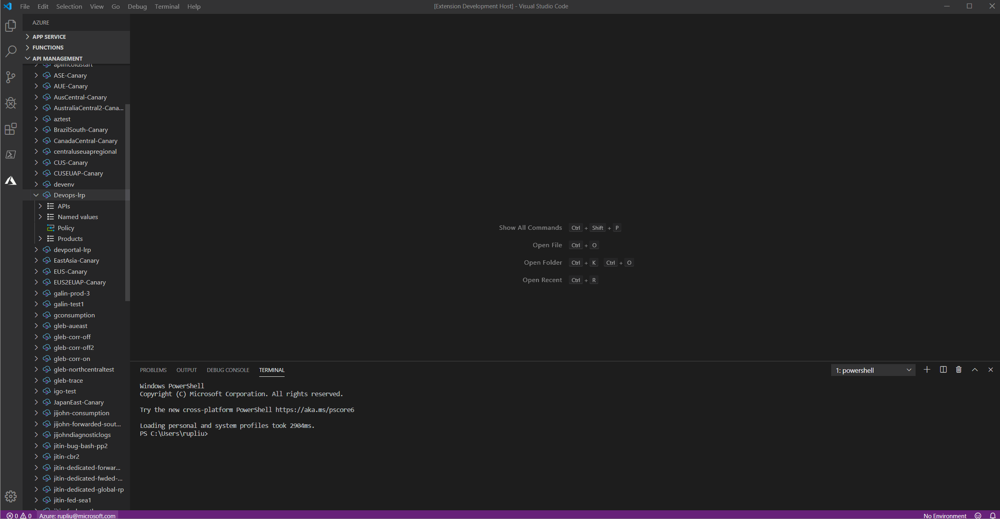
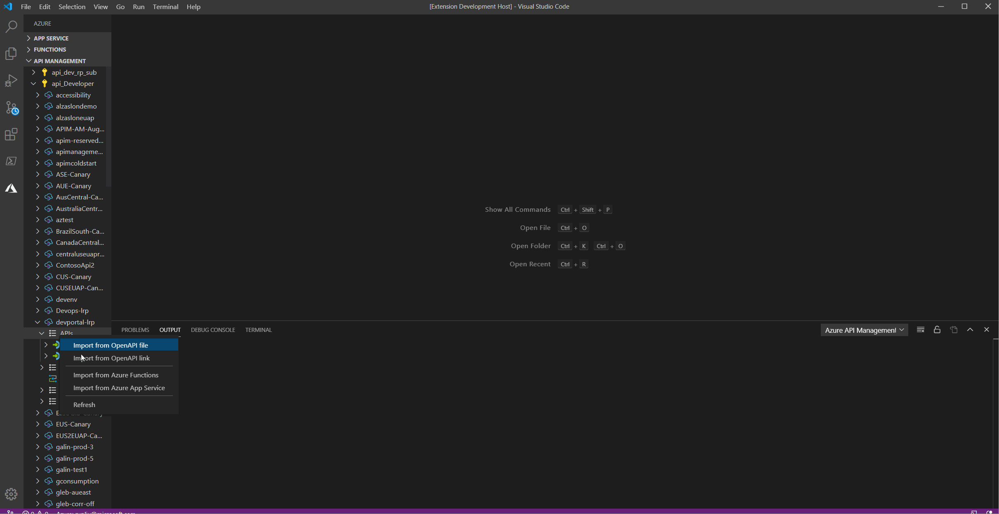
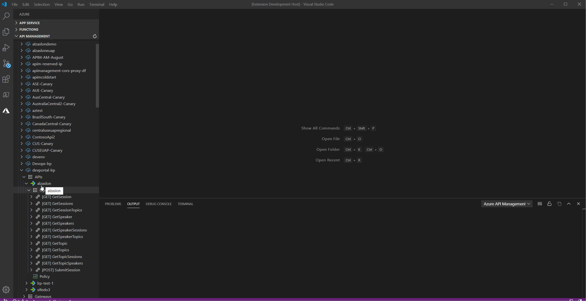
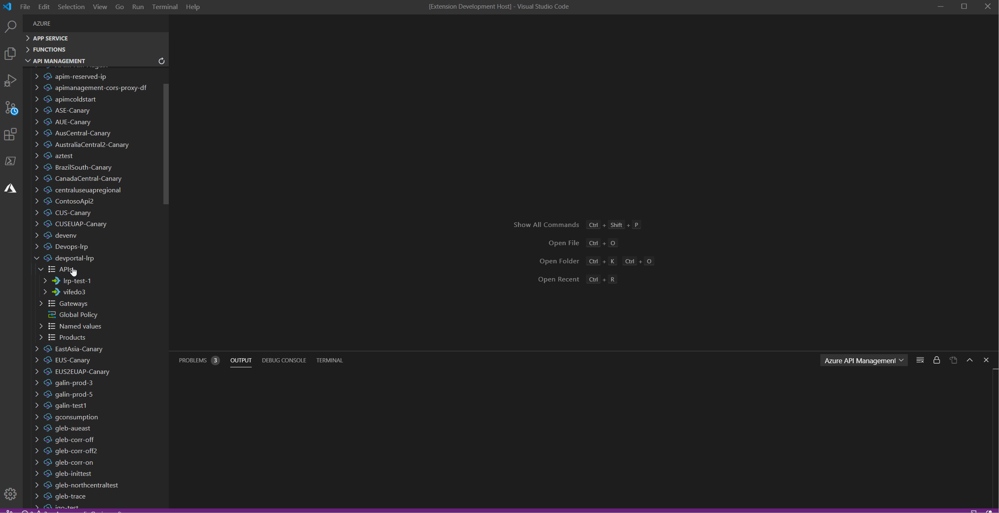
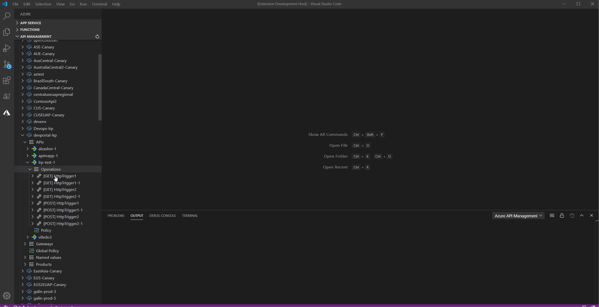
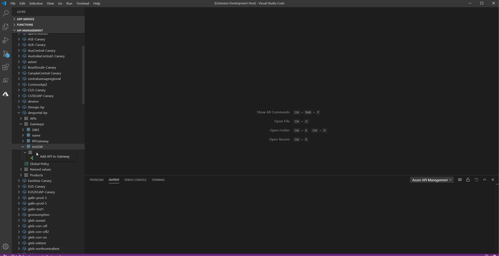
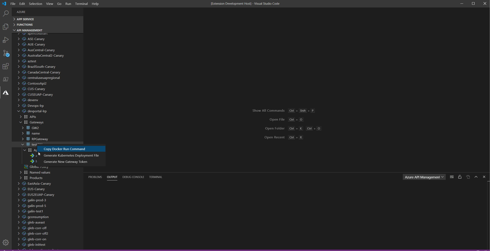
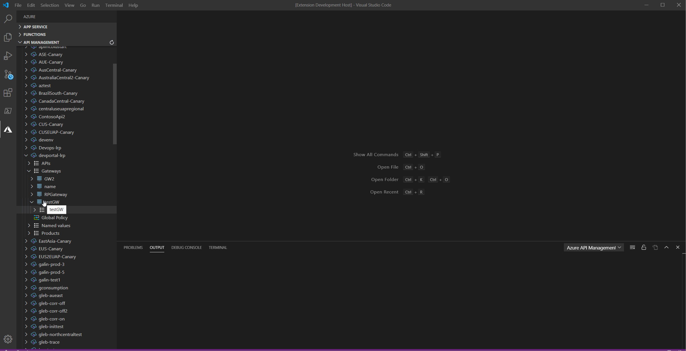

 
 

# Azure API Management Extension for Visual Studio Code (Preview)

Use the Azure API Management extension to perform common management operations on your Azure API Management service instances without switching away from Visual Studio Code.

[Azure API Management](https://aka.ms/apimrocks) is a fully managed service that helps customers to securely expose their APIs to external and internal consumers. API Management serves as a facade and a front door for the API implementations and enables their frictionless consumption by developers. Visit [this page](https://aka.ms/apimlove) for more information and resources related to Azure API Management.

## Requirements

All you need is an Azure Subscription to get started. If you don't have one, [click here](https://azure.microsoft.com/en-us/free/) for a free subscription with $200 in Azure credits!

## Main Features

-   Create and delete an API Management instance
-   Create an API by importing an OpenAPI specification
-   Edit APIs and operations in Azure Resource Manager or OpenAPI formats
-   Edit policies at any scope
-   Associate an API with a product
-   Create, delete, and edit Named Values
-   Test an API using [REST Client](https://marketplace.visualstudio.com/items?itemName=humao.rest-client)
-   Command Palette support for most features
-   Extract API and service configurations into ARM templates
-   Import Function App to existing API or creating new API
-   Import Web App to existing API or creating new API
-   Gateways and deploy gateways

## Create an API Management instance using defaults

## Create an API Management instance using custom options

## Create an API by importing an OpenAPI specification

Please note: only JSON format is supported currently.

## Edit an API in Azure Resource Manager format

## Edit an API in OpenAPI format

## Edit policies

## Test an API

## Create and edit a Named Value

## Extract Service or API

## Import Function App to create a new API

## Import Function App to an existing API

## Import Web App to create a new API

## Import Web App to an existing API

## Add API to gateway

## Generate K8s deployment file for gateway

## Generate docker run command for gateway

## Intellisense for Policy Expressions.

Follow instructions [here](https://github.com/microsoft/vscode-apimanagement/issues/37#issuecomment-516551741).

## Managing Azure Subscriptions

If you are not signed in to Azure, you will see a "Sign in to Azure..." link. Alternatively, you can select "View->Command Palette" in the VS Code menu, and search for "Azure: Sign In".

If you don't have an Azure Account, you can sign up for one today for free and receive $200 in credits by selecting "Create a Free Azure Account..." or selecting "View->Command Palette" and searching for "Azure: Create an Account".

You may sign out of Azure by selecting "View->Command Palette" and searching for "Azure: Sign Out".

To select which subscriptions show up in the extension's explorer, click on the "Select Subscriptions..." button on any subscription node (indicated by a "filter" icon when you hover over it), or select "View->Command Palette" and search for "Azure: Select Subscriptions". Note that this selection affects all VS Code extensions that support the [Azure Account and Sign-In](https://github.com/Microsoft/vscode-azure-account) extension.

## Contributing

There are several ways you can contribute to this repo:

-   **Ideas, feature requests and bugs**: We are open to all ideas and we want to get rid of bugs! Use the [Issues](https://github.com/Microsoft/vscode-apimanagement/issues) section to either report a new issue, share your ideas, or contribute to ongoing discussions.
-   **Documentation**: Found a typo or an awkwardly worded sentence? Submit a PR!
-   **Code**: Contribute bug fixes, features, or design changes:
    -   Clone the repository locally and open in Visual Studio Code.
    -   Install [TSLint for Visual Studio Code](https://marketplace.visualstudio.com/items?itemName=ms-vscode.vscode-typescript-tslint-plugin).
    -   Open the terminal (press `` CTRL+` ``) and run `npm install`.
    -   To build, press `F1` and type in `Tasks: Run Build Task`.
    -   Debug: press `F5` to start debugging the extension.

### Legal

Before we can accept your pull request you will need to sign a **Contribution License Agreement**. All you need to do is to submit a pull request, then the PR will get appropriately labelled (e.g. `cla-required`, `cla-norequired`, `cla-signed`, `cla-already-signed`). If you already signed the agreement we will continue with reviewing the PR, otherwise system will tell you how you can sign the CLA. Once you sign the CLA all future PR's will be labeled as `cla-signed`.

### Code of Conduct

This project has adopted the [Microsoft Open Source Code of Conduct](https://opensource.microsoft.com/codeofconduct/). For more information see the [Code of Conduct FAQ](https://opensource.microsoft.com/codeofconduct/faq/) or contact [opencode@microsoft.com](mailto:opencode@microsoft.com) with any additional questions or comments.

## Telemetry

VS Code collects usage data and sends it to Microsoft to help improve our products and services. Read our [privacy statement](https://go.microsoft.com/fwlink/?LinkID=528096&clcid=0x409) to learn more. If you don’t wish to send usage data to Microsoft, you can set the `telemetry.enableTelemetry` setting to `false`. Learn more in our [FAQ](https://code.visualstudio.com/docs/supporting/faq#_how-to-disable-telemetry-reporting).

## License

[MIT](LICENSE.md)
